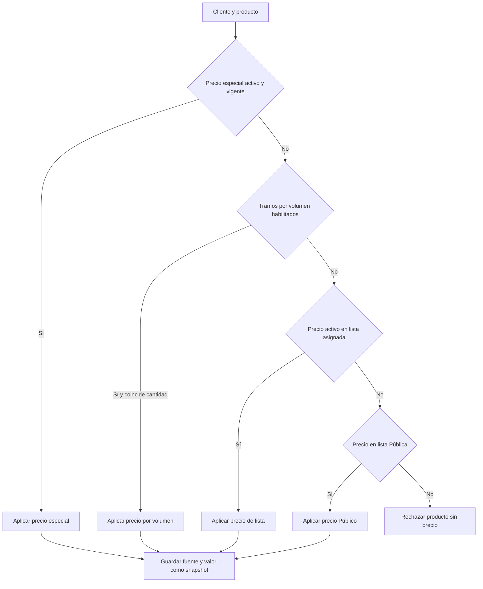
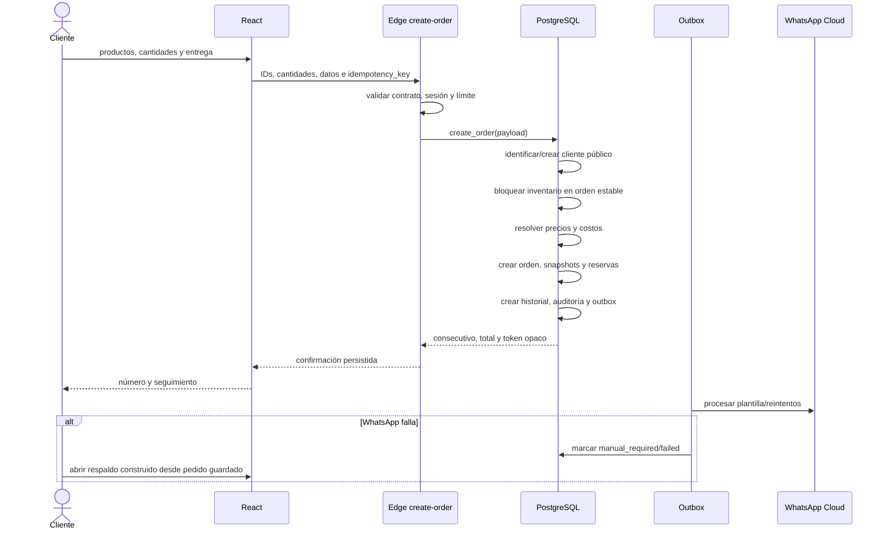

# Arquitectura y flujos

## Capas

- **Web:** React, Vite, TypeScript, React Router, Tailwind, React Hook Form y Zod.
- **Estado servidor:** TanStack Query. El carrito persiste únicamente `{productId, quantity}` en el dispositivo.
- **Backend:** Supabase Auth, PostgreSQL, RLS, Storage, Realtime y Edge Functions.
- **Operación:** funciones PostgreSQL para precios, pedidos, inventario, compras y pagos.
- **Notificaciones:** outbox persistente y Edge Function para WhatsApp Business Cloud.
- **Despliegue:** Netlify sirve `dist`; Supabase aloja datos y funciones.

## Estructura

```text
src/
  components/         interfaz reutilizable
  domain/             fórmulas e invariantes puras
  features/           auth, catálogo, carrito, pedidos y administración
  lib/                Supabase, formatos, errores y exportaciones
  pages/              rutas públicas, cliente y panel
  styles/             tokens y estilos globales
  types/              contratos de dominio
supabase/
  migrations/         esquema, RLS y API transaccional
  functions/          pedido y WhatsApp
  tests/              verificaciones SQL
  seed.sql             datos demo explícitos
docs/                  manuales y decisiones
```

## Flujo lógico de precios



El navegador muestra un precio orientativo devuelto por `get_catalog_prices()`. `create_order()` vuelve a resolverlo dentro de la transacción. Cualquier `price`, `subtotal`, `discount` o `total` enviado por un cliente se descarta.

## Flujo lógico del pedido



## Identidad

- Cliente recurrente: OTP SMS de Supabase al celular; no se guarda PIN recuperable.
- Cliente nuevo: puede comprar con datos mínimos y queda en lista Pública.
- Personal: email/contraseña de Supabase; se recomienda MFA en producción.
- `profiles`, `roles` y `user_roles` deciden autorización. Los botones ocultos no sustituyen RLS.

## Consistencia e idempotencia

- Los pedidos usan `idempotency_key` único.
- El inventario se bloquea y reserva dentro de la misma transacción.
- Entregar convierte reserva en salida; cancelar libera; nunca se modifica stock directamente.
- Los valores históricos de orden se guardan como snapshots.
- Pedidos, pagos, movimientos y auditoría no se borran físicamente.

## Realtime y PWA

Realtime solo avisa que cambió un pedido; el panel vuelve a consultar bajo RLS. La PWA almacena shell e imágenes, pero nunca confirma pedidos sin conexión.
