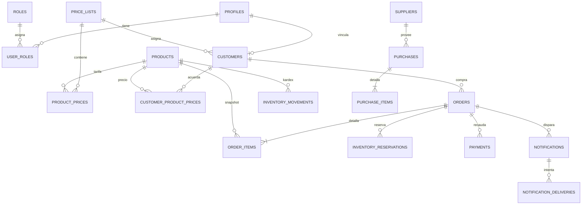

# Modelo de datos

## Áreas

| Área         | Tablas principales                                                                 | Propósito                                       |
| ------------ | ---------------------------------------------------------------------------------- | ----------------------------------------------- |
| Identidad    | `profiles`, `roles`, `user_roles`                                                  | perfil, rol y permisos de personal/cliente      |
| Clientes     | `customers`, `customer_addresses`                                                  | datos comerciales, crédito y direcciones        |
| Catálogo     | `categories`, `brands`, `products`, `product_variants`, `product_images`           | catálogo administrable y presentación           |
| Precios      | `price_lists`, `product_prices`, `customer_product_prices`, `quantity_price_tiers` | precios públicos, por lista, acuerdos y volumen |
| Pedidos      | `orders`, `order_items`, `order_status_history`                                    | snapshots inmutables y máquina de estados       |
| Entrega/pago | `delivery_methods`, `payment_methods`, `payments`                                  | opciones configurables y recaudo                |
| Inventario   | `inventory_reservations`, `inventory_movements`                                    | reserva y kardex auditable                      |
| Compras      | `suppliers`, `purchases`, `purchase_items`                                         | abastecimiento, recepción y costo promedio      |
| Gastos       | `expense_categories`, `expenses`                                                   | gasto operativo y soportes                      |
| Crédito      | `accounts_receivable`, `accounts_payable`                                          | cartera y obligaciones                          |
| Caja         | `cash_accounts`, `cash_movements`                                                  | flujo de efectivo separado de utilidad          |
| Notificación | `notifications`, `notification_deliveries`, `whatsapp_settings`                    | outbox, reintentos y proveedor                  |
| Sistema      | `app_settings`, `audit_logs`                                                       | marca, reglas, consecutivos y auditoría         |

## Convenciones

- UUID como identificador interno; consecutivos legibles como identificador comercial.
- `numeric(16,2)` para dinero y `numeric(16,3)` para cantidades; nunca `float`.
- `timestamptz` en UTC y visualización `America/Bogota`; fecha solicitada es `date`.
- `deleted_at`/`is_active` para maestros; datos financieros son append-only.
- `unique`, `check`, foreign keys e índices en relaciones, estados, celular y fechas.
- Vigencias evitan rangos incoherentes; el historial del pedido no depende de valores maestros futuros.

## Snapshots de pedido

`orders` conserva nombre, celular, dirección, forma de entrega/pago y totales. `order_items` conserva SKU, nombre, imagen, lista aplicada, fuente del precio, precio público, precio unitario, descuento, costo histórico y utilidad. Cambiar después un producto o una tarifa no reescribe órdenes anteriores.

## Inventario

El saldo físico vive en el producto/variante y solo cambia mediante funciones que insertan `inventory_movements`. Una reserva activa reduce disponible sin reducir existencia física. La entrega disminuye ambos; la cancelación solo libera reservado.

## Auditoría

`audit_logs` registra actor, acción, entidad, registro, estado anterior/nuevo, fecha, motivo e información técnica disponible. No se almacenan tokens ni contraseñas en la auditoría.

## Diagrama resumido

